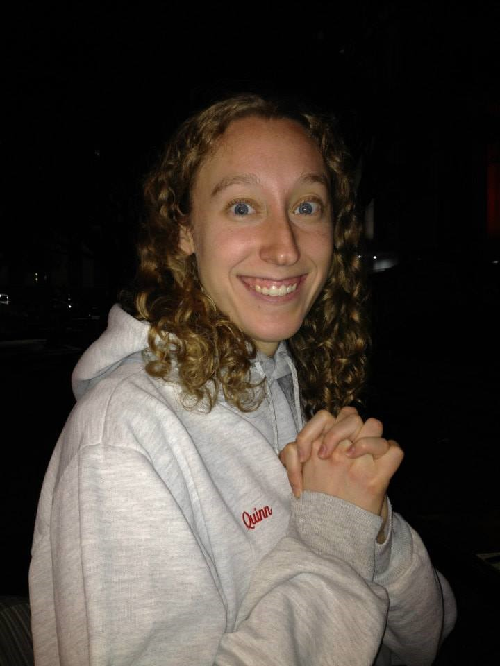

[Home](https://looixiv.github.io/Wedding.html)

Julianne (Julie) Quinn is the daughter of Michael and Mary Quinn. She and her three siblings, Amy, David and Daniel, grew up in Bedford, NH, a town most famous for its comedians (Seth Meyers and Sarah Silverman). She attended Manchester High School West, whose notable graduates include the McDonald brothers (as in the founders of McDonald's).

Unfortunately, Julie became neither a comedian nor founder of a fast food chain. She attended Columbia University where she decided to major in Environmental Engineering after taking a class called "A Better Planet By Design." She became excited by the idea that as an engineer she could design a better planet, and after receiving her B.S. in 2011, decided to pursue that further through a Ph.D. at Cornell University.

It was during Julie's Ph.D. studies that she fortuitously moved into the same apartment as Alex, who was working as a lab technician in the Department of Ecology and Evolutionary Biology after having received his B.S. in Natural Resources from Cornell in 2011. They bonded over their love of running, water resources and data analysis - a classic Cornellian nerd crush. But it was Alex's frequent acts of kindness, sweet gestures, and great sense of humor that ultimately won her over.

Alex proposed to Julie at the finish line of the Philadelphia Marathon in November 2017 after she qualified for the 2020 Olympic Trials. They now live together in Charlottesville, Virginia, where Julie is a Professor at the University of Virginia Department of Engineering Systems and Environment trying to design a better planet. Alex works for Commonwealth Computer Research Inc. as a data scientist analyzing things he can't tell us about (but maybe also designing a better planet?).
